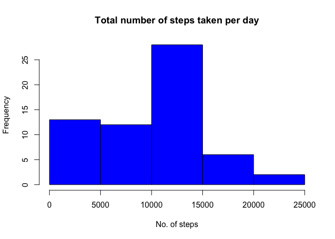
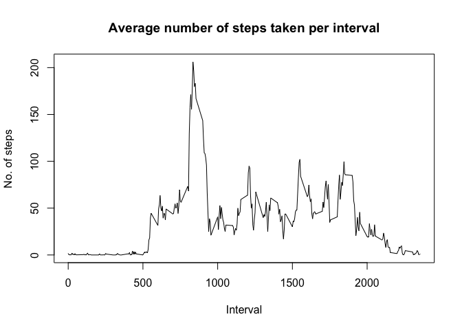
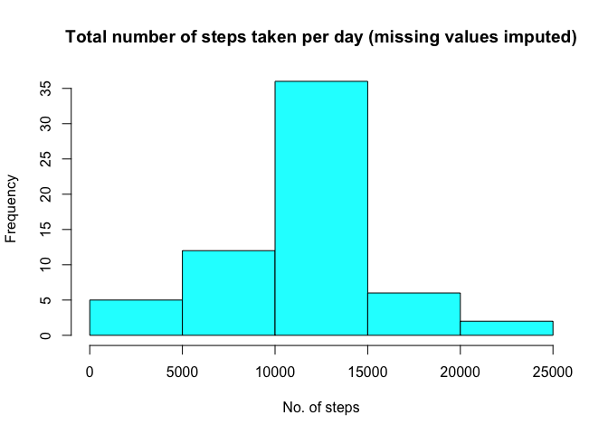
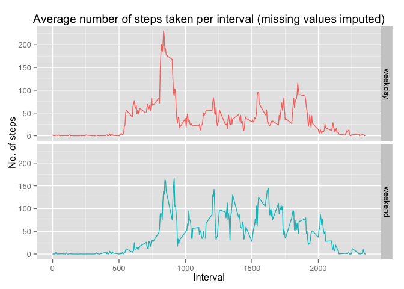

# Reproducible Research: Peer Assessment 1

```r
library (dplyr)
```

```
## 
## Attaching package: 'dplyr'
## 
## The following object is masked from 'package:stats':
## 
##     filter
## 
## The following objects are masked from 'package:base':
## 
##     intersect, setdiff, setequal, union
```

```r
library(lubridate)
library(ggplot2)
options(digits = 2, scipen=999)
```
  
    
## Loading and preprocessing the data

```r
unzip("activity.zip")
act <- read.csv(file = "activity.csv",stringsAsFactors = FALSE, na.strings="NA")
str(act)
```

```
## 'data.frame':	17568 obs. of  3 variables:
##  $ steps   : int  NA NA NA NA NA NA NA NA NA NA ...
##  $ date    : chr  "2012-10-01" "2012-10-01" "2012-10-01" "2012-10-01" ...
##  $ interval: int  0 5 10 15 20 25 30 35 40 45 ...
```

```r
act <-tbl_df(act)

## Parse dates using lubridate, sort
act <- mutate(act, date = ymd(date))
act <- arrange(act, date, interval)
```
## What is mean total number of steps taken per day?

```r
act_sum <- 
        act %>%
        group_by(date) %>%
        summarize(daytot = sum(steps,na.rm = TRUE))
        
with(act_sum,{
        hist(daytot,
        main = "Total number of steps taken per day",
        xlab = "No. of steps",
        ylab = "Frequency",
        col = "blue"
        )
}
)
```

 

```r
daymean <- mean(act_sum$daytot,na.rm = TRUE)
daymedian <- median(act_sum$daytot, na.rm = TRUE)
```
  
The mean and median of the total number of steps taken per day are **9354.23** and **10395** respectively.
  
## What is the average daily activity pattern?


```r
act_ts <- 
        act %>%
        group_by(interval) %>%
        summarize(stepmean = mean(steps,na.rm = TRUE))
        
with(act_ts,{
        plot(interval,stepmean,
        main = "Average number of steps taken per interval",
        xlab = "Interval",
        ylab = "No. of steps",
        type = "l"
        )
}
)
```

 

```r
interval_max_start <-
        act_ts %>%
        filter(stepmean==max(act_ts$stepmean)) %>%
        select(interval) %>%
        as.integer()

interval_max_end <- interval_max_start + 5

interval_max_start <- paste("0",interval_max_start, sep="")
interval_max_end <- paste("0",interval_max_end, sep="")
```

The 5-minute interval **from 0835 hrs to 0840 hrs** contains the maximum number of steps on average across all the days in the dataset.

## Imputing missing values

```r
missing <- sum(is.na(act))
```
The dataset contains **2304** missing values.  
  
I choose to impute missing values with the mean number of steps for the 5-min interval, averaged across all days. The number of steps for each interval is likely to be determined to some degree by habit / routine. For example, the person is likely to be asleep at 3am daily, leading to a zero or low number of steps taken.  


```r
act_impute <- merge(act,act_ts,by="interval")
act_impute <- mutate(act_impute,steps = ifelse(is.na(steps),stepmean,steps))

act_impute_sum <- 
        act_impute %>%
        group_by(date) %>%
        summarize(daytot = sum(steps))
        
with(act_impute_sum,{
        hist(daytot,
        main = "Total number of steps taken per day (missing values imputed)",
        xlab = "No. of steps",
        ylab = "Frequency",
        col = "cyan"
        )
}
)
```

 

```r
daymean_impute <- mean(act_impute_sum$daytot)
daymedian_impute <- median(act_impute_sum$daytot)
```
  
Without imputing values, the mean and median of the total number of steps taken per day is **9354.23** and **10395** respectively. With missing values imputed, the mean and median are **10766.19** and **10766.19** respectively. The median is now equal to the mean.

## Are there differences in activity patterns between weekdays and weekends?

```r
act_daytype_ts <- 
        act_impute %>%
        mutate(day = weekdays(date),type = ifelse(day =="Saturday" | day == "Sunday","weekend","weekday")) %>%
        group_by(interval,type) %>%
        summarize(stepmean = mean(steps))

## define plot
plotts <- ggplot(act_daytype_ts , aes(interval, stepmean)) +
        facet_grid(type ~ .) +  
        
        
        labs (x = "Interval", 
              y = "No. of steps", 
              title = "Average number of steps taken per interval (missing values imputed)") +
        
        theme(legend.position = "none") +
        geom_line(aes(color = type))


print(plotts)
```

 

Comparing average steps per interval on weekdays and weekends, I make a few observations:  
1. Between midnight and about 5am, the person takes minimal steps. This applies to both weekdays and weekends.  
2. The maximum / highest average number of steps is lower on weekends compared to weekdays.  
3. On weekends, steps are more "spread out" over the course of the day.
